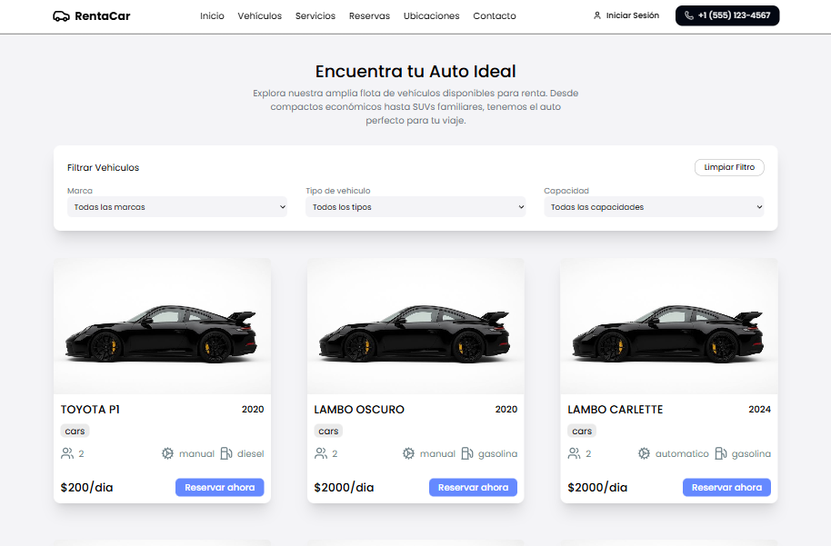
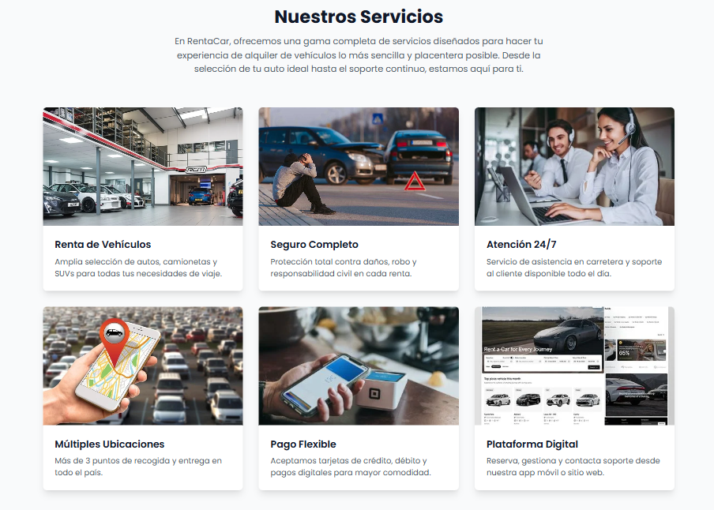
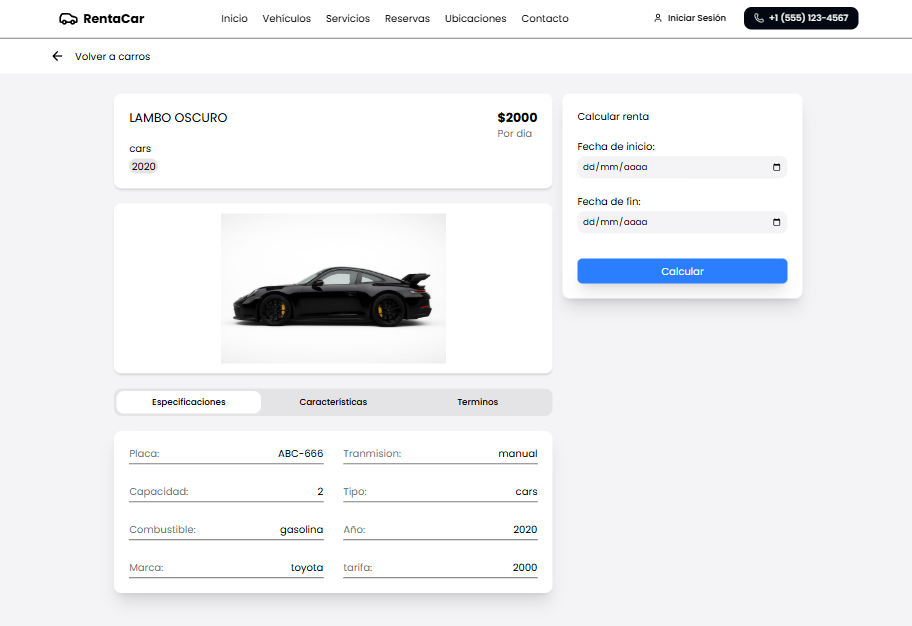
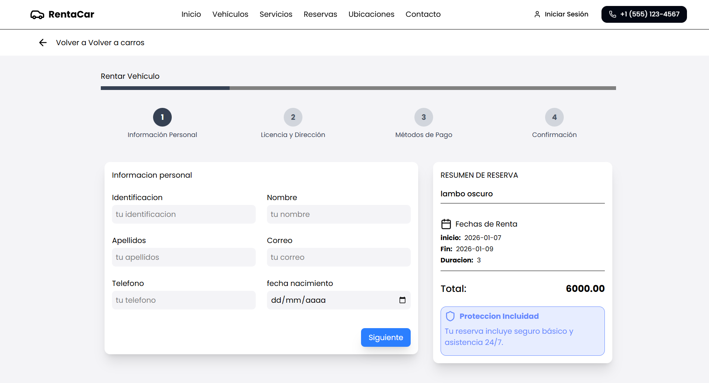
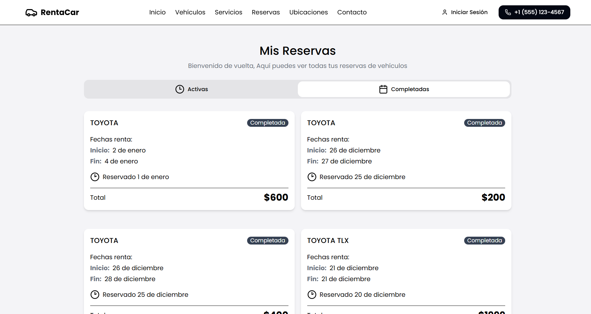

# 🚗 Car Rental E-commerce - Full Stack Project

¡Bienvenido a la plataforma definitiva de renta de vehículos! Este proyecto es un e-commerce robusto diseñado para ofrecer una experiencia de usuario fluida y una administración de flota eficiente.

Demo:
👉 https://ecommerce-renta-de-carros-1.onrender.com

## 🌟 Características

### Parte del Cliente (Frontend)

- **Interfaz Moderna:** Diseño responsivo y estilizado con **Tailwind CSS**.
- **Experiencia Dinámica:** Animaciones fluidas utilizando **Framer Motion** para una navegación premium.
- **Catálogo Interactivo:** Filtros avanzados por categoría, precio y disponibilidad.
- **Sistema de Reservas:** Proceso de selección de fechas y vehículos intuitivo.

### Panel Administrativo (Dashboard)

- **Gestión de Inventario:** Alta, baja y edición de vehículos en tiempo real.
- **Control de Rentas:** Monitorización de estados de reserva ( Activa, Finalizada).
- **Control de Clientes:** Monitorización de registros de clientes
- **Control de usuarios del sistema:** Monitorización de registros de usuarios administrativos
- **Métricas:** Visualización de estadísticas clave del negocio.

---

## 🛠️ Stack Tecnológico

**Frontend:**

- [React.js](https://reactjs.org/) - Librería principal.
- [Tailwind CSS](https://tailwindcss.com/) - Estilizado rápido y moderno.
- [Framer Motion](https://www.framer.com/motion/) - Animaciones de alta calidad.

**Backend:**

- [Node.js](https://nodejs.org/) - Entorno de ejecución.
- [Express](https://expressjs.com/) - Framework para la API.
- [Supabase](https://supabase.com/) - Base de Datos (PostgreSQL), Autenticación y Almacenamiento.

---

## ⚙️ Arquitectura del Proyecto

- Separación clara entre frontend y backend
- API RESTful
- Manejo de variables de entorno
- Despliegue en Render
- Almacenamiento de imágenes en la nube (no local)

## 📸 Capturas del sistema

### Cliente

